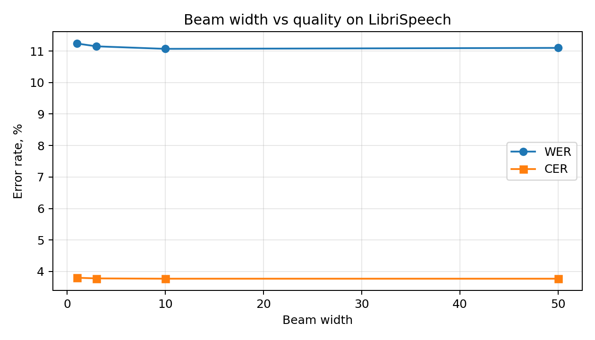
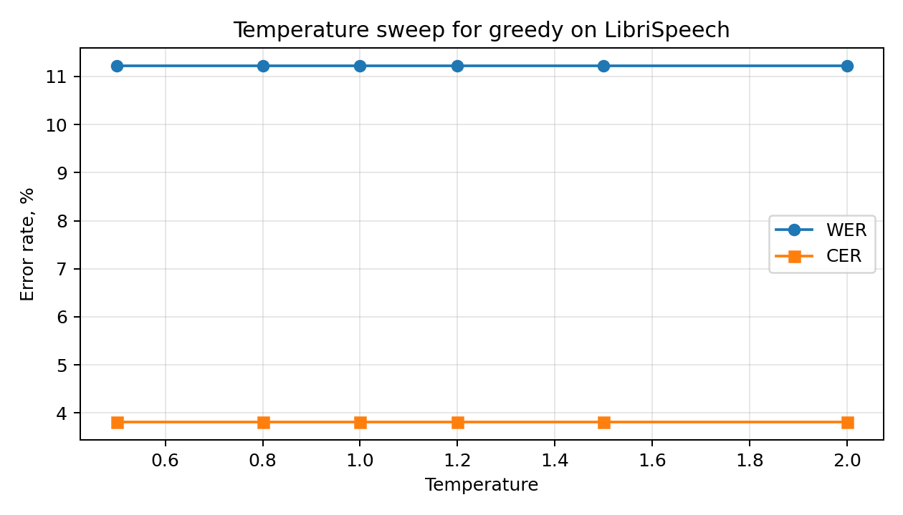
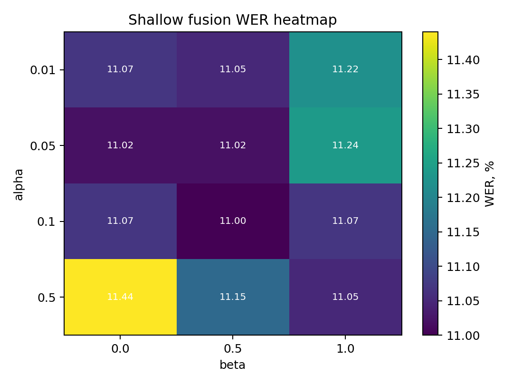
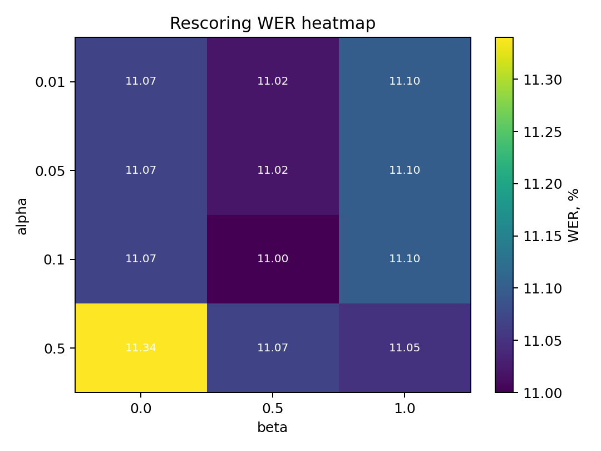
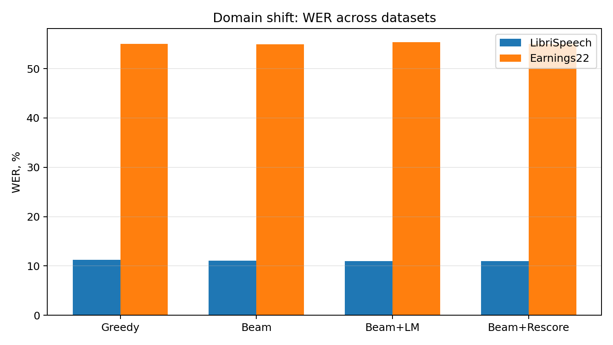
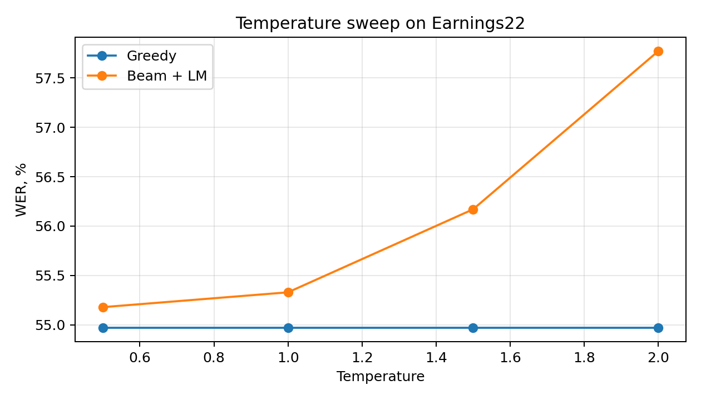
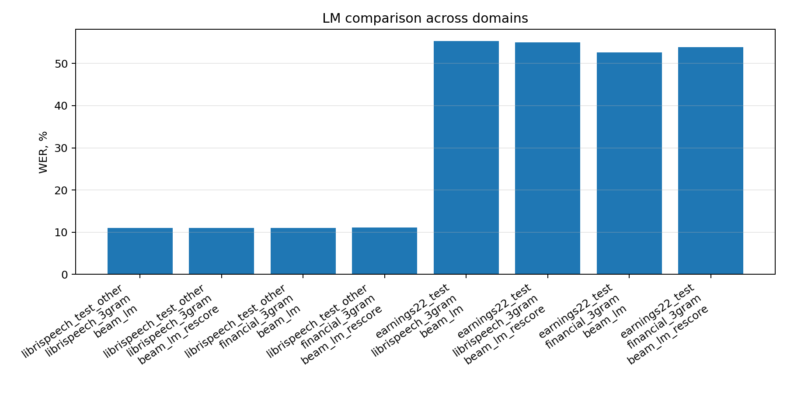

# Отчет по Assignment 2

## 1. Что было нужно сделать

Во второй домашней работе нужно было реализовать несколько способов CTC-декодирования для готовой модели `facebook/wav2vec2-base-100h` и посмотреть:

- как отличаются `greedy` и `beam search`,
- помогает ли внешняя языковая модель,
- что делает temperature scaling,
- что происходит при переходе с LibriSpeech на финансовую речь Earnings22.

Метрики везде одинаковые: `WER` и `CER`.

## 2. Базовые декодеры

### Greedy

Greedy decoding берет самый вероятный токен на каждом шаге, потом удаляет `blank` и схлопывает повторы.

| Метод | WER | CER |
|---|---:|---:|
| Greedy | 11.22% | 3.81% |

### Beam search

Beam search хранит несколько лучших гипотез вместо одной, поэтому может исправлять локальные ошибки greedy.

| Beam width | WER | CER |
|---|---:|---:|
| 1 | 11.24% | 3.80% |
| 3 | 11.15% | 3.78% |
| 10 | 11.07% | 3.77% |
| 50 | 11.10% | 3.77% |

Вывод: beam search действительно помогает, но немного. Лучший результат у меня получился при `beam_width = 10`. Дальше качество почти не растет.



## 3. Temperature scaling

Я прогнал greedy decoding с разными значениями температуры на LibriSpeech.

| Temperature | WER | CER |
|---|---:|---:|
| 0.5 | 11.22% | 3.81% |
| 0.8 | 11.22% | 3.81% |
| 1.0 | 11.22% | 3.81% |
| 1.2 | 11.22% | 3.81% |
| 1.5 | 11.22% | 3.81% |
| 2.0 | 11.22% | 3.81% |

Здесь кривая полностью плоская. Это ожидаемо, потому что greedy все равно берет `argmax`, а деление логитов на положительную константу порядок значений не меняет.



## 4. Языковая модель

### Shallow fusion

В shallow fusion score LM добавляется прямо во время beam search:

`score = log_p_acoustic + alpha * log_p_lm + beta * num_words`

Полную сетку я прогнал по `alpha` и `beta`, а лучший результат получился такой:

| Метод | Alpha | Beta | WER | CER |
|---|---:|---:|---:|---:|
| Beam + LM | 0.1 | 0.5 | 11.00% | 3.75% |



### LM rescoring

Во втором варианте сначала строятся beam-гипотезы только по акустической модели, а потом они пересчитываются с помощью LM.

Лучший результат:

| Метод | Alpha | Beta | WER | CER |
|---|---:|---:|---:|---:|
| Beam + rescoring | 0.1 | 0.5 | 11.00% | 3.75% |



Вывод по двум LM-методам: оба варианта немного улучшают plain beam search, но выигрыш небольшой. На LibriSpeech модель и так сильная, поэтому внешняя LM помогает только точечно.

## 5. Качественные примеры

Ниже несколько примеров, где LM что-то меняет.

**Пример 1**

```text
REF:  and why did andy call mister gurr father
BEAM: and why did andy call mister gurfather
SF:   and why did andy call mister gur father
RS:   and why did andy call mister gur father
```

Тут обе LM-стратегии исправляют слитное написание.

**Пример 2**

```text
REF:  a fellow who was shut up in prison for life might do it he said but not in a case like this
BEAM: a fellow who as shut up in prison for life might doit he said but not in a case like this
SF:   a fellow who as shut up in prison for life might do it he said but not in a case like this
RS:   a fellow who as shut up in prison for life might do it he said but not in a case like this
```

Здесь LM исправляет `doit -> do it`, но не исправляет `was -> as`.

**Пример 3**

```text
REF:  awkward bit o country sir six miles row before you can find a place to land
BEAM: alkward but a country sir six miles oro before you cand find a place to land
SF:   alkward but a country sir six miles or o before you cand find a place to land
RS:   alkward but a country sir six miles oro before you cand find a place to land
```

Это уже обратный случай: shallow fusion делает хуже, а rescoring оставляет исходную гипотезу.

## 6. Domain shift

После LibriSpeech я прогнал лучшие настройки на `Earnings22`.

| Метод | LibriSpeech WER | LibriSpeech CER | Earnings22 WER | Earnings22 CER |
|---|---:|---:|---:|---:|
| Greedy | 11.22% | 3.81% | 54.97% | 25.58% |
| Beam search | 11.07% | 3.77% | 54.94% | 25.38% |
| Beam + LM | 11.00% | 3.75% | 55.33% | 25.42% |
| Beam + rescoring | 11.00% | 3.75% | 55.00% | 25.41% |

На `Earnings22` качество резко падает. Это и есть domain shift, модель обучалась на LibriSpeech, а финансовая речь заметно отличается по лексике и условиям записи.

Кроме того, LibriSpeech 3-gram LM на `Earnings22` не помогает, а местами даже чуть ухудшает результат.



## 7. Temperature на Earnings22

Я отдельно посмотрел, как температура влияет на out-of-domain данные.

| Temperature | Greedy WER | Beam + LM WER |
|---|---:|---:|
| 0.5 | 54.97% | 55.18% |
| 1.0 | 54.97% | 55.33% |
| 1.5 | 54.97% | 56.17% |
| 2.0 | 54.97% | 57.77% |

Greedy снова плоский, а вот `beam + LM` при росте температуры только ухудшается. То есть в этой задаче temperature scaling проблему не решает.



## 8. Financial LM

Чтобы проверить гипотезу про домен, я обучил свою 3-граммную KenLM на `data/earnings22_train/corpus.txt`.

Получились такие файлы:

- `lm/financial-3gram.arpa`
- `lm/financial-3gram.arpa.gz`
- `lm/financial-3gram.binary`

После этого я сравнил две LM:

- `librispeech_3gram`
- `financial_3gram`

| LM | Датасет | Метод | WER | CER |
|---|---|---|---:|---:|
| LibriSpeech 3-gram | LibriSpeech | Beam + LM | 11.00% | 3.75% |
| LibriSpeech 3-gram | LibriSpeech | Beam + rescoring | 11.00% | 3.75% |
| LibriSpeech 3-gram | Earnings22 | Beam + LM | 55.33% | 25.42% |
| LibriSpeech 3-gram | Earnings22 | Beam + rescoring | 55.00% | 25.41% |
| Financial 3-gram | LibriSpeech | Beam + LM | 11.00% | 3.76% |
| Financial 3-gram | LibriSpeech | Beam + rescoring | 11.07% | 3.78% |
| Financial 3-gram | Earnings22 | Beam + LM | 52.59% | 25.09% |
| Financial 3-gram | Earnings22 | Beam + rescoring | 53.89% | 25.22% |

Financial LM заметно улучшила именно `Earnings22`, но не помогла на `LibriSpeech`. Значит, проблема действительно была в домене


## 9. Итог

Главные выводы у меня такие:

- beam search немного лучше greedy, но разница небольшая;
- на LibriSpeech внешняя LM помогает слабо;
- rescoring и shallow fusion у меня дали почти одинаковый лучший результат;
- на Earnings22 наблюдается сильный domain shift;
- LibriSpeech LM почти бесполезна для финансовой речи;
- financial-domain LM заметно улучшает результат именно на Earnings22.

Главный итог: хорошая языковая модель помогает только тогда, когда она действительно подходит к домену.
